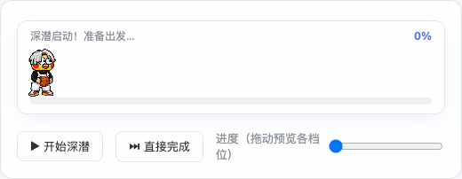

# 🐤 dsh-ikun-pet · ikun Desktop Pet

[](https://github.com/eric-song-dev/dsh-ikun-pet)
[](./LICENSE)
[](https://github.com/eric-song-dev/dsh-ikun-pet/stargazers)

> 📖 中文文档：[README.zh.md](README.zh.md)



> A DeepSeek Harness (DSH) plugin that fills the full row under the **"Deep diving..." status line** with an ikun pet during **every reply**:
> a `0% → 100%` progress bar, **a new animation and text every 20%**, and a jump celebration with a system-level "你干嘛~哎哟" voice cue at completion 🏀

## ✨ Features

- **Only fills the deep-dive dock**: registered at `conversation.input.dock` — the full row directly below
  DSH's "Deep diving..." status line, between the conversation and the composer. Visible only while a
  session is `running` (deep diving); completely invisible the rest of the time.
- **The pet walks the progress bar**: the ikun pet walks from 3% to 97%, playing frame-by-frame on top of
  the progress bar (8 columns × 9 rows sprite-sheet contract).
- **A new stage every 20%**: six stages at 0/20/40/60/80/100, each switching both the animation and the
  text (see [docs/PROGRESS-STAGES.md](docs/PROGRESS-STAGES.md)).
- **Universal adaptive progress**: a layered estimation model — real anchors (0% start / 100% done) +
  real goal-round progress + self-calibration from this session's turn durations + activity pacing for
  tools/streaming/approval-waiting + a shrinking reserve. Short tasks run fast, long tasks run slow,
  waiting for your approval slows it down honestly, and it never fakes 100%
  (details in [docs/PROGRESS-STAGES.md](docs/PROGRESS-STAGES.md)).
- **Completion heard system-wide**: at 100% the host process plays "你干嘛~哎哟" (`assets/voice.mp3`)
  with a system command — audible from any window and any session, independent of browser mute
  (tested on macOS).
- **Permanent plugin form**: written into the DSH composition (`cordis.patch.yml`) and auto-loaded on
  every DSH start — install once, works in every session. Dynamic-plugin sources (`src/`) are kept as
  an alternative for session-level installs.

## 🚀 Install

**Option A: clone** (for tinkerers)

```bash
git clone https://github.com/eric-song-dev/dsh-ikun-pet && cd dsh-ikun-pet
dsh plugin add "$PWD"
```

**Option B: remote one-liner** (for users)

```bash
dsh plugin add github:eric-song-dev/dsh-ikun-pet
# or: dsh plugin add https://github.com/eric-song-dev/dsh-ikun-pet.git
```

Then restart `dsh web` and refresh the browser. Verify:

```bash
curl -sI http://127.0.0.1:3080/ikun-pet/spritesheet.webp   # sprite route (should be image/webp)
curl -s  http://127.0.0.1:3080/plugins/dsh-ikun-pet/client.js   # client bundle (should return JS)
```

## 🎬 Stage → animation → text

| Progress | Animation | Text |
| ---: | --- | --- |
| 0% – 20% | waiting | 深潜启动！准备出发… |
| 20% – 40% | runRight | 正在收集线索… |
| 40% – 60% | working | 埋头苦干中… |
| 60% – 80% | review | 认真思考中… |
| 80% – 100% | wave | 快好啦！马上见结果~ |
| 100% (done) | jump | 完成啦！你干嘛~哎哟 🔉 (host plays the voice cue) |

## ⚙️ Configuration (optional)

Everything lives in the plugin line's `config` inside the bundled `cordis.patch.yml`:
`spritePath` / `voicePath` / `playVoiceAtDone` / `playCommand` (assets default to the bundled `assets/`).

- **Disable**: remove the `#` in front of `# disabled: true`, restart `dsh web` (put it back to re-enable)
- **Mute the voice**: `config.playVoiceAtDone: false` (the animated bar is unaffected)
- **Voice on Windows/Linux**: swap `playCommand` to PowerShell / ffplay (examples in the comments;
  macOS defaults to `afplay`, tested)

## 🗑 Uninstall / 🔄 Update

```bash
dsh plugin remove dsh-ikun-pet     # uninstall (bundles are reconciled automatically), then restart dsh web
# update: cd <repo dir> && git pull && dsh plugin add "$PWD"
```

## 🧪 Session-level install (dynamic plugin)

```bash
node scripts/build-package.mjs     # produces the ikun.package.json install payload
```

Hand the payload to your Agent to install via `cordis_define` + `cordis_run` — current session only.
⚠️ Don't run it alongside the permanent plugin (their sprite routes conflict).

## 🖥 Platform support

| Part | macOS | Windows / Linux |
| --- | --- | --- |
| Animated UI + progress bar (pure Web) | ✅ tested | ⚠️ should work, untested |
| Completion voice (system command) | ✅ tested (`afplay`) | ⚠️ commands provided, untested |

## 🛟 Troubleshooting

| Symptom | Fix |
| --- | --- |
| Plugin line fails on restart | `node -e "require('dsh-ikun-pet')"` in the profile dir should succeed; reinstall if it doesn't |
| Dock not showing but routes work | hard refresh (Cmd+Shift+R); make sure the dynamic plugin isn't enabled at the same time |
| No voice | check `config.playVoiceAtDone`; macOS uses `afplay`, other OSes need a different `playCommand` |
| Don't want it to load | add `disabled: true` to the plugin line and restart |

## 📄 License

MIT
